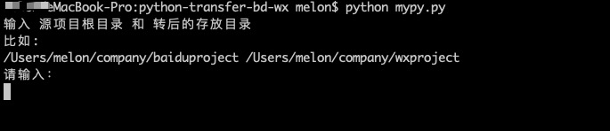
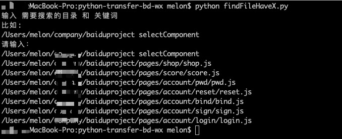

# py-transfer-BdToWx
百度小程序转微信小程序

---
## 只需一个py文件，一条命令
---

### 运行条件
具备Python环境，可在命令行中使用Python命令

### 使用方法

##### 1. 转换工具 - mypy.py

###### 命令行输入： python mypy.py



##### 2. 查找关键词工具 - findFileHaveX.py

###### 命令行输入： python findFileHaveX.py



### 转换规则

###### 查看 mypy.py 源代码，可以很直观知道做了哪些修改，也就是你可以自己更新转换规则，欢迎一起维护

### 百度与微信的区别

##### 百度编译能通过而微信不能的情况
###### 情况一：
```
Component({
    properties: {
        item: {
              //错误，需写明type、value等字段
        }
    },
    data: {
    },
    methods: {
    }
})
```

###### 情况二：
```
<text class="{{(selectCourse[index1*3+index2]==1?'row_item_select':'row_item_unselect'}}">{{item}}</text>
#(selectCourse 多了一个左括号
```
###### 情况三：
```
Setting data field "score" to undefined is invalid.
setData({}) 方法不允许赋 undefined
```
###### 情况四：
```
#js中通过id获取组件
this.selectComponent("score") //错误
this.selectComponent("#score") //正确
```
###### 情况五：
```
#xml中for循环
s-for="majorList" / s-for="{{majorList}}"  //百度都可以
wx:for="{{majorList}}"                     //微信必须加{{}}
```
###### 情况六：
```
//banner显示问题，事实上这个是平常都应该注意的细节
.banner {
  display: flex;
  flex:1;
 # flex-direction: column; //百度不写正常，微信不写不显示
  margin-top: 30rpx;
}
```
###### 情况七：
```
userInfo = res.data.data.user_info; //百度编译通过并能正常赋值，类似Python
userInfo = res.data.data.user_info; //微信编译不通过，需加let/var定义变量
```
